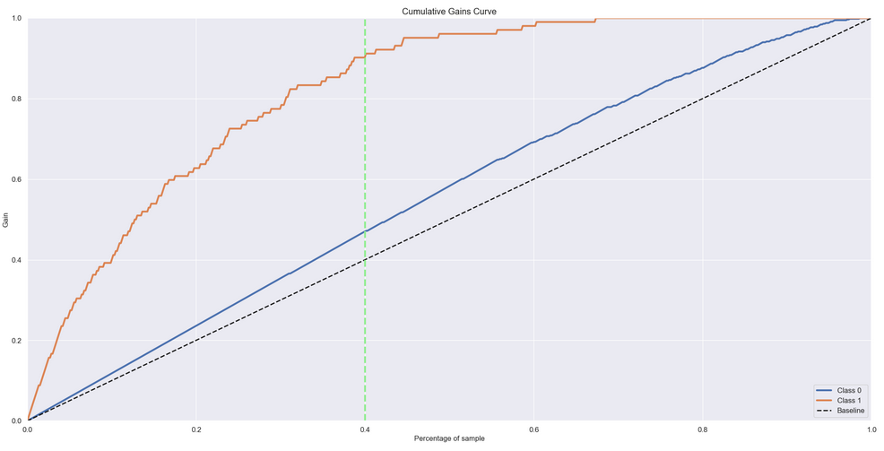

# ifood

Uma empresa bem estabelecida no setor de alimentos de varejo possui uma base de dados de vários centenas de milhares de clientes registrados e atende a quase um milhão de consumidores por ano. Apesar de ter tido receitas sólidas e uma boa linha de fundo nos últimos três anos, as perspectivas de crescimento de lucro para os próximos três anos não são animadoras.

O departamento de marketing está sob pressão para gastar seu orçamento anual de maneira mais sábia. O CMO percebeu a importância de ter uma abordagem mais quantitativa ao tomar decisões e contratou uma pequena equipe de cientistas de dados com o objetivo claro de construir um modelo preditivo que apoiará as iniciativas de marketing direto.

O objetivo da equipe de cientistas de dados é construir um modelo preditivo que produza o maior lucro possível para a próxima campanha de marketing direto, agendada para o próximo mês. Essa nova campanha tem como foco a venda de um novo gadget para a base de dados de clientes. Para construir o modelo, uma campanha piloto envolvendo 2.240 clientes foi realizada. Os clientes foram selecionados aleatoriamente e contatados por telefone para adquirir o gadget. Durante os meses seguintes, os clientes que compraram a oferta foram devidamente rotulados. O objetivo da equipe é desenvolver um modelo que prevê o comportamento do cliente e aplicá-lo ao resto da base de clientes. Espera-se que o modelo permita à empresa escolher os clientes que têm mais probabilidade de adquirir a oferta, deixando de lado os não-respondentes e tornando a próxima campanha altamente rentável.

Além disso, o CMO está interessado em entender e estudar as características dos clientes. Por isso, a equipe de cientistas de dados também desenvolverá uma segmentação de clientes para melhor entender suas características e oferecer benefícios personalizados para aumentar a fidelidade. O sucesso dessas atividades provará o valor da abordagem e convencerá os mais céticos dentro da empresa.

|Feature | Descrição |
|:------:|:----------|
|AcceptedCmp1| 1 se o cliente aceitou a oferta na 1ª campanha. 0 caso contrário |
|AcceptedCmp2| 1 se o cliente aceitou a oferta na 2ª campanha, 0 caso contrário |
|AcceptedCmp3| 1 se o cliente aceitou a oferta na 3ª campanha, 0 caso contrário |
|AcceptedCmp4| 1 se o cliente aceitou a oferta na 4ª campanha, 0 caso contrário |
|AcceptedCmp5| 1 se o cliente aceitou a oferta na 5ª campanha. 0 caso contrário |
|Response (target) | 1 se o cliente aceitou a oferta na última campanha. 0 caso contrário |
|Complain| 1 se o cliente reclamou nos últimos 2 anos |
|DtCustomer| Data de inscrição do cliente na empresa |
|Education| Nível de educação do cliente |
|Marital| Estado civil do cliente |
|Kidhome| Número de crianças pequenas na casa do cliente |
|Teenhome| Número de adolescentes na casa do cliente |
|Income| Renda anual da casa do cliente |
|MntFishProducts| Valor gasto em produtos de peixe nos últimos 2 anos |
|MntMeatProducts| Valor gasto em produtos de carne nos últimos 2 anos |
|MntFruits| Valor gasto em frutas nos últimos 2 anos |
|MntSweetProducts| Valor gasto em produtos doces nos últimos 2 anos |
|MntWines| Valor gasto em vinhos nos últimos 2 anos |
|MntGoldProds| Valor gasto em produtos de ouro nos últimos 2 anos |
|NumDealsPurchases| Número de compras realizadas com desconto |
|NumCatalogPurchases| Número de compras realizadas com o catálogo |
|NumStorePurchases| Número de compras realizadas diretamente nas lojas |
|NumWebPurchases| Número de compras realizadas através do site da empresa |
|NumWebVisitsMonth| Número de visitas ao site da empresa no último mês |
|Recency| Número de dias desde a última compra |

## Questões do negócio

1.  Qual a porcentagem de clientes interessados em adquirir a oferta, o time de vendas conseguirá contatar se 20% da base de dados for contatada?
2. E se a capacidade do time de vendas aumentar 40% da base, qual a porcentagem de clientes interessados o time de vendas conseguirá contatar? 
3. Quantos grupos foram criados na segmentação?
4. Qual o grupo mais rentável ?
5. Quais as principais características do grupo mais rentável ?
5. Qual a porcentagem de contribuição do faturamento, vinda do grupo ?
7. Qual as condições para ser adicionada ou removida do grupo?

## Premissas de negócio
<ul>
<li>A base de dados fornecida possui apenas 2240 clientes, oque pode prejudicar a capacidade de classificação</li>
<li>o dataset foi dividido apenas entre treino e teste, devido ao taamnho reduzido não foi criado o de validação</li>
</ul>

## Planejamento de solução

Neste projeto foi aplicado o método CRISP-DM (Cross-Industry Standard Process for Data Mining) adaptado para os processos de ciência de dados que se tornou o CRIS-DS.

Modelo crisp-dm.

A divisão dos passos utilizados no projeto foi:

<ol>
<li><strong>Entendimento de negócio:</strong> Entender a solicitação do departamento de marketing e desenvolver uma solução eficiente para aumentar a eficácia dos gastos com base em uma abordagem mais quantitativa é essencial. Além disso, é importante avaliar as características dos clientes e agrupá-los para oferecer benefícios personalizados e aumentar a fidelidade. O objetivo principal é construir um modelo preditivo que permita à empresa escolher os clientes com maior probabilidade de adquirir um novo produto, tornando a próxima campanha de marketing direto altamente rentável.
</li>

<li>
<strong>Coleta de dados:</strong> Todos os dados estavam disponíveis na plataforma, sendo esta disponibilizada pela própria empresa.
</li>
<li>
<strong>Análise descritiva:</strong> Uma breve análise dos dados para adquirir familiaridade com eles. Os dados foram divididos em numéricos e categóricos para aplicarmos os métodos de análise adequados para cada tipo.
    <ul>
        <li>Dados númericos: Observar valores de tendência central e de dispersão</li>
        <li>Dados categóricos: Observar a frequência dos valores</li>
    </ul>
</li>
<li>
<strong>Dados faltantes:</strong> Foi identificado 29 valores faltante na coluna 'income' foi optado pela remoção dessas 29 linhas.
</li>
<li>
<strong>Filtragem de dados:</strong>Remoção de colunas que foram substituídas por variáveis derivadas das mesmas e aquelas que possuíam valores constantes, além de linhas com valores que provavelmente se deram por erros de input. Sendo eles:
<ul>
        <li>Colunas removidas: 'dt_customer','year_birth''z_cost_contact', 'z_revenue';</li>
        <li>Linhas removidas: 
            <ul>
            <li>Linhas duplicadas desconsiderando o 'id';</li> 
            <li>Linhas que a coluna 'marital_status' possui os seguntes códigos:['ABSURD','YOLO'];</li> 
            <li>Linhas que a coluna 'Year_birth' com valores menores que 1940.</li>
            <li>Linhas que a coluna 'mnt_meat_products' possui valores menores que 1582.</li>    
            <li>Linha que a coluna 'income' tem valor de 666666</li>
            </ul>
         </li>
</ul>
</li>
<li>
<strong>Feature engineering:</strong> Para compreender melhor o comportamento dos clientes, foram criados novos atributos a partir dos existentes.
    
    
|Atributo          |Descrição                                      |
|:----------------:|:---------------------------------------------:|
|age               | idade do cliente                              |
|n_family_members  | Número de mebrom da familia                   |
|n_sons            | número de filhos                              |
|days_since_signup | Número de dias que o cliente se cadastrou     |
|income_per_member | renda por número de mebros da familia         |
|total_spent       | Total comprado de todas as catégorias         |
|total_accepted    | Total de ofertas aceitas em campanhas passadas|
</li>
<li>
<strong>Análise exploratória de dados I (EDA I):</strong> Análise dos novos atributos criados, testando e validando hyphoteses para melhor entender o comportamento deles e como se relacionam. A analise consistiu em alguma etapas. Sendo elas:
<ul>
    <li>Analise dos atributos com a biblioteca pandas-profiling onde foi possivel ver alguns outliers que poderiam atrapalhar o modelo, assim foi decidida a remoção dos mesmos</li>
    <li>Foi verificado quais atributo tinham maior variabilidade, assim melhor contribuindo para o modelo.</li>
    <li>Hipoteses de négocio foram testada para verificar como as variavéis se comportavam com a variável resposta e tentar retirar alguma informação relevante que pudesse ser passada ao time de marketing</li>
    <li>Para a segmentação foi feito um estudo do espaço dos  atributos levando eles para o espaço de "embedding". sendo aplicados os algoritimos: PCA, UMAP, T-SNE, Tree-based embedding</li>
    <ul>
    <li>PCA;</li> 
    <li>UMAP;</li> 
    <li>T-SNE;</li> 
    <li>Tree-based embedding.</li>
    </ul>
</ul>
    <strong>Ao final da etapa o 'UMAP' apresentou a melhor divisão de espaço. sendo o espaço gerado palo método salvo em um dataframe para ser utilizado nos próximos passos.Gráficamente o agrupamento no espaço  pode ser visto a seguir:</strong>

    
<li>
<strong>Preparação dos dados:</strong> Manipular os dados para se adequarem melhor num modelo de machine learning. foi aplicado a re-escala dos atributos numéricos para não força o modelo a trabalhar com valores muito altos: 
<ul>
<li>
MinMaxscaler: foi aplicado a todos os atributos.
</li>
</ul>
</li>
    
<li>
<strong>Feature selection:</strong> Neste primeiro ciclo do CRISP foi utilizado o algoritmo boruta para definir os atributos que iremos utilizar no treinamento, o algoritmo retornou quatro variáveis, mas não seria interessante montar um modelo apenas com estas variáveis. Então, foi aplicado o método de feature importance para definir o peso que os atributos tem no modelo.
&nbsp;
        

Após os resultados foi decidido que as variáveis: 'teenhome','kidhome','n_sons','accepted_cmp4','accepted_cmp2','complain','education'.
</li>

<li>
<strong>Modelos de machine learning rankemaneto:</strong> Nesta etapa foram aplicados seis algoritmos de machine learning para definir qual tinha melhor resultados e se adequava melhor ao comportamento dos dados. Sendo eles:
<ul>
    <li>KNeighborsClassifier(KNN)</li>
    <li>Naive bayes</li>
    <li>Balanced Random Forest</li>
    <li>Logistic Regression ;</li>
    <li>Random Forest classifier;</li>
    <li>Extra Tree classifier;</li>
    <li>XGboost classifier.</li>
</ul>
Ao final o modelo escolhido foi o Balanced Random Forest, mais a frente será mostrado o motivo da escolha
</li>
<li>   
<strong>Modelos de machine learning clusterização:</strong> Nesta etapa foram aplicados três algoritmos de clusterização e observado quais as métricas se comportavam melhor para determinado número de clusters:
    <ul>      
    <li>K-Means;</li>
    <li>Gaussian Mixture Model(GMM);</li>
    <li>Hierarchical Clustering;</li>
Ao final foi escolhido o Kmeans.
</ul>

<li>
<strong>Fine tuning:</strong> O fine tuning de modelos de clusterização é feito pela análise dos valores das métricas com diferentes número de clustes. As métricas utilizadas foram:
<ul>
   <li>Within-Cluster Sum of Square (WSS)</li>
   <li>elbow</li>
   <li>Sillhouete Score</li>
</ul>
</li>

</ol>

## Os Principais insights de negócio

## Performance do modelo de Rankeamento
As métricas de classificação tradicionais, como precisão e recall, são úteis para avaliar a performance geral de modelos de recomendação, mas não levam em consideração a ordem em que os itens foram recomendados. Por isso, são usadas as métricas até k, que avaliam a relevância dos k primeiros itens recomendados.

No entanto, essas métricas podem ser afetadas pelo desbalanceamento dos dados usados no treinamento do modelo. Por isso, o “balanced_accuracy_score” também é utilizado para avaliar a performance do modelo, levando em conta o desbalanceamento.

Para garantir a generalização dos resultados de performance e evitar que um modelo tenha melhores resultados por coincidência, o método de Cross-validation foi aplicado.

Para este projeto as métricas para avaliação foram:
<ul>
    <li>Precion_at_k(precision@k);</li>
    <li>Recall_at_k(recall@k);</li>
    <li>Balanced_acurracy_score.</li>
</ul>

| model name                 | precision_cv | prec_std | recall_cv | rec_std | balanced_acc_cv | bal_std | k   | precision_at_k_cv | perc_k_std | recall_at_k_cv | rec_k_std |
|:--------------------------:|:------------:|:--------:|:---------:|:-------:|:---------------:|:-------:|:---:|:-----------------:|:----------:|:--------------:|:---------:|
| Linear model CV            | 0.837        | 0.0058   | 0.6999    | 0.0068  | 0.6999          | 0.0068  | 200 | 0.4229            | 0.0215     | 0.8225         | 0.0       |
| balanced random forrest CV | 0.6742       | 0.0118   | 0.7916    | 0.0226  | 0.7916          | 0.0226  | 200 | 0.4096            | 0.0261     | 0.7966         | 0.0       |
| Random forrest CV          | 0.789        | 0.054    | 0.6428    | 0.0243  | 0.6428          | 0.0243  | 200 | 0.4063            | 0.0169     | 0.7902         | 0.0       |
| Extra trees CV             | 0.7824       | 0.0458   | 0.6409    | 0.0243  | 0.6409          | 0.0243  | 200 | 0.4063            | 0.0169     | 0.7902         | 0.0       |
| XGBoost CV                 | 0.7663       | 0.0128   | 0.7152    | 0.0256  | 0.7152          | 0.0256  | 200 | 0.403             | 0.0186     | 0.7838         | 0.0       |
| KNN CV                     | 0.7615       | 0.0374   | 0.6552    | 0.0102  | 0.6552          | 0.0102  | 200 | 0.3549            | 0.0085     | 0.6903         | 0.0       |
| naive bayers CV            | 0.6662       | 0.0195   | 0.7223    | 0.0266  | 0.7223          | 0.0266  | 200 | 0.3549            | 0.0285     | 0.6903         | 0.0       |

O modelo que obteve melhor resultado foi o Balanced Random Forest, apresentando a melhor combinação de valor de recall@K com um bom balanced_accuracy_score, então foi seguido com ele para etapa de fine tuning.
Na etapa do fine tuning,foram otimizados os hiperparâmetros do modelo para tentar melhorar os resultados, e um bom incremento foi conseguido durante o fine tuning. Os valores após o fine tuning foram:

| model name      | precision_cv | prec_std | recall_cv | rec_std | balanced_acc_cv | bal_std | k   | precision_at_k_cv | perc_k_std | recall_at_k_cv | rec_k_std |
|:---------------:|:------------:|:--------:|:---------:|:-------:|:---------------:|:-------:|:---:|:-----------------:|:----------:|:--------------:|:---------:|
| balanced rf  CV | 0.7353       | 0.0097   | 0.8765    | 0.0106  | 0.8765          | 0.0106  | 200 | 0.4809            | 0.0102     | 0.9355         | 0.0       |

## Resultados de previsão

As curvas de ganho e lift são ferramentas de avaliação comuns em problemas de classificação binária, como é o caso de muitos modelos de recomendação. A curva de ganho compara a taxa de verdadeiros positivos (TP) do modelo com a proporção de exemplos positivos no conjunto de teste. Já a curva de lift compara a taxa de TP do modelo com a taxa esperada, considerando que a escolha dos exemplos positivos é feita aleatoriamente.

Essas métricas foram utilizadas para responder as questões de négocio.

<strong>Qual porcentagem de clientes interresados o time de marketing consigurá contatar oferecendo a ofertar para os primeiros 20% dos clienetes da lista ordenada?</strong>

Com 133 ligações o time de vendas atingirá 62.75% dos clientes interresados em toda base disponível, considerando que ao total se tem 668 de possíveis clientes, 133 represanta apenas 19.91% do total, ou seja, ligando para menos de um quinto da base de dados é possivel atingir mais da metade dos possivelmente interresados 

Utilizando o modelo aleátorio, que poderia ser só uma seleção aleátoria dos clientes ou uma simples ordenação por algum atributo, ligando para 133 clientes atingiriamos apenas 20 dos 102 clientes interresados, já como o nosso modelo atingimos 64, assim, captando 3.2 vezes mais potênciais clientes

<strong>Se a capacidade do time de marketing dobrar? qual a porcentagem de potênciais clientes que será atingida?</strong>

Com 266 ligações o time de vendas atingirá 90.2% dos clientes interresados em toda base disponível, considerando que ao total se tem 668 de possíveis clientes, 266 represanta apenas 39.82% do total, ou seja, ligando para menos da metade base de dados é possivel atingir a grande maioria dos possivelmente interresados 

Utilizando o modelo aleátorio, que poderia ser só uma seleção aleátoria dos clientes ou uma simples ordenação por algum atributo, ligando para 266 clientes atingiriamos apenas 40 dos 102 clientes interresados, já como o nosso modelo atingimos 92, assim, captando 2.3 vezes mais potênciais clientes

## Performance do modelo de clusterização

Nesse projeto, utilizamos três algoritmos de clusterização - Kmeans, Gaussian Mixture Model (GMM) e Hierarchical Clustering (HC) - em cada espaço de features e de embeddings. Para avaliar a qualidade dos agrupamentos produzidos, utilizamos a métrica de silhueta, que mede a distância entre os pontos de dados e seus respectivos clusters em relação aos outros clusters.

Em cada caso, variamos o número de clusters e avaliamos o valor de Silhouette Score obtido para cada quantidade. Observamos que, em geral, a performance dos modelos aumentava à medida que o número de clusters aumentava, mas devido a restrições de negócios, decidimos limitar o número máximo de clusters para 10.

Os resultados obtidos foram os seguintes:

Apesar de apresentar uma boa silhouetta,como pode ser observado no [notebook](https://github.com/lavinomenezes/ifood_data_analyst_challenge/blob/main/notebooks/ifood_lm_v09_segmentation_feature_space.ipynb) os resultados de socre não foram tão satisfátorios. Então foi realizada a análise no espaço de embedding, que resultou nos seguintes valores

## Performance de cluster

## Resultados de clusterização
